[itsfizys.gg](https://itsfizys.gg) &nbsp;·&nbsp;
[discord](https://discord.gg/aerox) &nbsp;·&nbsp;
[youtube](https://youtube.com/@aeroxdevs) &nbsp;·&nbsp;
[instagram](https://www.instagram.com/aeroxdevs)

> Student developer. Founder of [AeroX](https://discord.gg/aerox), a dev community 
> built around the process of turning ideas into real things.

I build Discord bots and the tooling around them. Most of what I ship lives inside 
[AeroX Development](https://github.com/AeroXDevs), 6k+ members, from concept to commit. 
Also deep into Minecraft plugin/mod development and open-source bot infrastructure.

<samp>javascript &nbsp; typescript &nbsp; discord.js &nbsp; node &nbsp; python &nbsp; mongodb &nbsp; docker &nbsp; git &nbsp; linux</samp>

**[AeroX-CV2-Music-Bot](https://github.com/itsfizys/AeroX-CV2-Music-Bot)** &nbsp;·&nbsp; <samp>javascript, discord.js</samp> 
Music bot built on Discord's Components V2. The flagship bot of AeroX, 
22 stars, 33 forks, and actively maintained.

**[Typescript-Handler](https://github.com/itsfizys/Typescript-Handler)** &nbsp;·&nbsp; <samp>typescript, discord.js</samp> 
A clean, modular Discord.js command handler. Fork it and you're running 
in minutes, no boilerplate fighting required.

**[handler-mongodb](https://github.com/itsfizys/handler-mongodb)** &nbsp;·&nbsp; <samp>javascript, mongodb</samp> 
The same handler, now with a real database layer. Persistent state, 
clean architecture, ready to scale.

**[minecraft-dev-guide](https://github.com/itsfizys/minecraft-dev-guide)** &nbsp;·&nbsp; <samp>java, glsl</samp> 
Everything Minecraft development in one place: Paper plugins, Forge and 
Fabric mods, shaders, OpenGL/GLSL, and the full plugin ecosystem.

No third-party widgets. No stats cards that go down at 2am. Every graphic 
on this page is generated by [this repo](.github/workflows/stats.yml), pulling 
straight from the GitHub API once a day and committing only what changed.

Built it this way because I got tired of profiles that break. If you want the 
same setup, everything is here: the scripts, the fonts, the workflow. Fork it, 
swap in your username, push. Takes about ten minutes.

The stats workflow needs a user-owned GitHub token in the `PROFILE_STATS_TOKEN` 
Actions secret. It is required so the contribution total includes private activity, 
matching the count shown on the signed-in GitHub profile.
